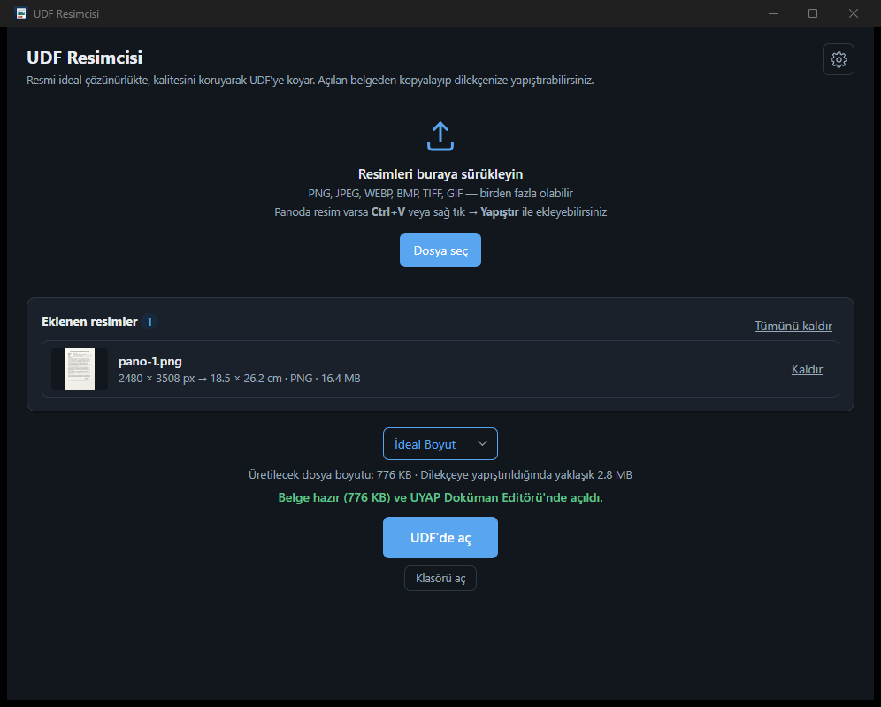
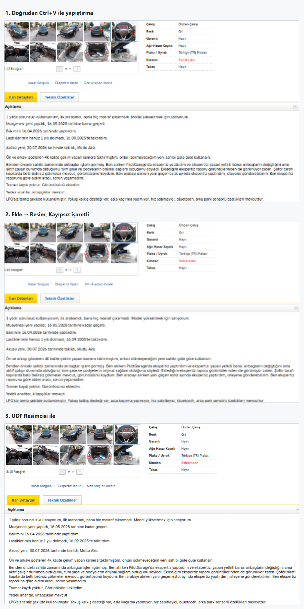

# UDF Resimcisi

Bir fotoğrafı, taranmış bir sayfayı ya da ekran görüntüsünü **ideal çözünürlükte, kalitesini
koruyarak** `.udf` belgesine koyan Windows uygulaması. Belge UYAP Doküman Editörü'nde (UDE)
açılır; oradan kopyalayıp dilekçelere yapıştırılabilir.



Üç şeyi çözer:

1. **Okunmaz resim sorunu.** UDE bir resmi **Ekle → Resim** yoluyla belgeye alırken onu
   sayfadaki görüntüleme boyutuna, yaklaşık 72 DPI'a küçültür: 3000 × 2000 piksellik bir
   tarama belgeye 524 × 349 piksel olarak girer, ince yazılar okunmaz olur. Ekleme
   penceresindeki **Kayıpsız** seçeneği bunu değiştirmez. UDF Resimcisi `.udf` dosyasını
   kendisi yazdığı için o küçültme hiç çalışmaz.
2. **Şişkin dosya sorunu.** Varsayılan **İdeal Boyut**, gözle görülür hiçbir fark
   bırakmadan dosyayı küçültür: 3,5 MB'lık telefon fotoğrafından 300 KB'lık `.udf` çıkar.
3. **Kopyala-yapıştır.** Üretilen belge UDE'de açılır; **Ctrl+A**, **Ctrl+C** ile
   kopyalayıp dilekçenizde **Ctrl+V** ile istediğiniz yere yapıştırırsınız.

> Bu uygulama UYAP veya HAVELSAN ile ilişkili değildir. Yalnızca birlikte çalışabilirlik için
> UDF dosyası üretir; UDE'ye ait hiçbir kod içermez.

## UYAP Resim Ekle aracıyla fark ne kadar?

Aynı ekran görüntüsünü (bir ilan sayfası) dilekçeye üç yolla koyduk; aşağıda üçü de UDE'de
aynı büyütmede görünüyor:

1. **Doğrudan yapıştırma.** Ekran görüntüsünü UDE'de **Ctrl+V** ile yapıştırınca UDE resmi
   küçültür; sonuç en kötüsüdür, yazılar okunmaz olur.
2. **Ekle → Resim, Kayıpsız işaretli.** Görüntüyü dosya olarak kaydedip UDE'nin **Ekle →
   Resim** penceresinden **Kayıpsız** seçeneğiyle eklemek biraz daha iyi sonuç verir; ama
   küçültme yine çalışır, yazılar hâlâ bulanıktır.
3. **UDF Resimcisi.** Belgeyi kendisi yazdığı için küçültme hiç devreye girmez; resim
   ekrandaki hâliyle, piksel piksel belgeye girer.



Bu yalnızca ekran görüntülerinde değil, her resimde böyledir: taranmış sayfa, telefon
fotoğrafı, ekspertiz raporu. UDE'nin kendi yollarıyla giren resim her zaman ekran
çözünürlüğüne düşer; UDF Resimcisi'yle giren resim olduğu gibi kalır.

### İdeal Boyut ile Orijinal Boyut arasında fark var mı?

Gözle görülür bir fark yok. Belgede ikisi de aynı yeri kaplar; değişen yalnızca içindeki piksel
sayısı ve dosya boyutudur. Ölçülmüş dosya boyutları (ölçüm aracı ve yöntem
[DOGRULAMA.md](DOGRULAMA.md) içinde):

| Girdi | Basamak | Belgeye giren resim | `.udf` dosyası | Dilekçeye yapıştırıldığında |
| --- | --- | --- | --- | --- |
| 12 MP telefon fotoğrafı (4000 × 3000, 3,5 MB JPEG) | Orijinal Boyut | 4000 × 3000 px | 3,55 MB | ≈ 13,4 MB |
| | **İdeal Boyut** | 1575 × 1181 px | **300 KB** | ≈ 1,6 MB (ölçüldü: 1,65 MB) |
| | Orta Boyut | 1050 × 788 px | 68 KB | ≈ 0,5 MB |
| | Küçük Boyut | 526 × 395 px | 13 KB | ≈ 0,1 MB |
| Taranmış A4 sayfa (2480 × 3508, 300 DPI, 1,9 MB JPEG) | Orijinal Boyut | 2480 × 3508 px | 1,93 MB | ≈ 7,7 MB |
| | **İdeal Boyut** | 1574 × 2227 px | **777 KB** | ≈ 2,8 MB |
| | Orta Boyut | 1050 × 1485 px | 250 KB | ≈ 1,0 MB |
| | Küçük Boyut | 525 × 743 px | 60 KB | ≈ 0,2 MB |

### Yapıştırınca dosya neden büyüyor?

Son sütun önemli: UDE, panodan yapıştırılan **her resmi PNG olarak yeniden kodlar** — bizim
dosyada JPEG olsa bile. Bu yüzden dilekçenizin büyüyeceği miktar `.udf` dosyasının boyutu
değil, resmin **piksel sayısıdır**. 300 KB'lık İdeal Boyut belgesi dilekçeye yaklaşık 1,6 MB
olarak girer; Orijinal Boyut'taki aynı fotoğraf 13 MB'a çıkıp UYAP'ın yaklaşık **10 MB** evrak
sınırını aşar. Word'den çevrilen belgelerde de resim genellikle benzer piksel sayısıyla PNG
olarak gömüldüğü için iki yol aynı büyüklükte çıkabilir; fark, resmin okunabilirliğinde ve
`.udf` dosyasını doğrudan yüklediğinizde ortaya çıkar.

Uygulama iki sayıyı da gösterir: kalite listesinin altındaki satırda üretilecek dosyanın
boyutu ve dilekçeye yapıştırıldığında yaklaşık ne kadar yer tutacağı yazar. Ekran
görüntülerinde İdeal Boyut zaten küçük olan orijinali büyütmez; orijinal olduğu gibi kalır.

## Ne yapar

- Sürüklenen, seçilen ya da panodan yapıştırılan resimleri tek bir `.udf` belgesine koyar ve
  UDE'de açar.
- Varsayılan **İdeal Boyut**, gözle görülür fark bırakmadan dosyayı 10 kata kadar küçültür.
  **Orijinal Boyut** seçilirse PNG ve JPEG girdilerinde tek bir bayt bile değiştirilmez.
- Kalite listesi resmin sayfada kapladığı yeri değiştirmez; yalnızca dosya boyutunu belirler.
- Telefon fotoğraflarındaki EXIF yön bilgisini okur; gerekiyorsa resmi kayıpsız PNG'ye
  çevirip düzeltir.
- Resimler eklendikçe üretilecek dosyanın boyutunu gerçekten hesaplayıp gösterir; dilekçeye
  yapıştırıldığında kaplayacağı yeri de yazar.
- Birden çok resim tek belgeye eklendiğinde araya boş satır ya da sayfa sonu koyar.
- Yeni sürüm çıktığında haber verir ve tek tıkla kendini günceller.

## Kurulum

### [⬇ UDF-Resimcisi-kurulum.exe indir](https://github.com/SCgrS/UDF-Resimcisi/releases/latest/download/UDF-Resimcisi-kurulum.exe)

Tek dosya, 2 MB. Windows 10 ve üzeri, 64 bit; yönetici hakkı gerekmez. **UYAP Doküman
Editörü kurulu olmalıdır**: uygulama belgeyi UDE'de açar, UDE yoksa çalışmaz.

1. Yukarıdaki bağlantıya tıklayıp dosyayı indirin.
2. İndirilen `UDF-Resimcisi-kurulum.exe` dosyasına **çift tıklayın**.
3. Dosya imzalı olmadığı için Windows SmartScreen bir uyarı gösterebilir:
   **Daha fazla bilgi** yazısına tıklayın, sonra çıkan **Yine de çalıştır** düğmesine basın.
4. Kurulum birkaç saniye sürer; bitince Başlat menüsünden **UDF Resimcisi**'ni açın.

Kurulum sistem klasörlerine bir şey yazmaz:

- Uygulama `%LOCALAPPDATA%\UDF Resimcisi` klasörüne kopyalanır.
- Başlat menüsüne **UDF Resimcisi** kısayolu eklenir.
- Windows'un "Uygulamalar ve özellikler" listesine kaydedilir.

Kurulum istemiyorsanız [Sürümler sayfasında](https://github.com/SCgrS/UDF-Resimcisi/releases)
iki seçenek daha var: `UDF-Resimcisi-tasinabilir.exe` (5 MB; indirin, çift tıklayın, çalışır)
ve `UDF-Resimcisi-x64.msi` (3 MB; kurumsal dağıtım için).

### Güncelleme

Uygulama kendini günceller. Her açılışta GitHub'dan son sürümü sorar; yeni sürüm varsa
pencerenin üstünde bir şerit çıkar. **Güncelle**'ye bastığınızda kurulum dosyası indirilir,
kısa bir ilerleme penceresiyle kurulur ve uygulama yeni sürümüyle yeniden açılır; ayarlarınıza
dokunulmaz. **Daha sonra** derseniz şerit kapanır, bir sonraki açılışta yeniden hatırlatılır.

Beklemek istemiyorsanız **Ayarlar → Şimdi denetle ve güncelle** aynı işi hemen yapar.
Açılıştaki denetimi **Ayarlar → Açılışta yeni sürümü denetle** kutusundan kapatabilirsiniz;
o zaman yalnızca düğmeye bastığınızda sorulur.

## Kullanım

1. Resimleri pencereye sürükleyin ya da **Dosya seç**'e basın. Panoda bir resim varsa
   (örneğin `Win+Shift+S` ile alınmış ekran görüntüsü) **Ctrl+V** ile veya pencerede sağ
   tıklayıp **Yapıştır** ile ekleyin.
2. Kalite listesinde **İdeal Boyut** seçili gelir; çoğu iş için değiştirmeniz gerekmez.
3. **UDF'de aç**'a basın. Belge kaydetme klasörüne yazılır ve UDE'de açılır.
4. UDE'de **Ctrl+A** ile tümünü seçin, **Ctrl+C** ile kopyalayın; dilekçenizi açıp
   istediğiniz yere **Ctrl+V** ile yapıştırın. Belgeyi tek başına da kullanabilirsiniz:
   `.udf` dosyası UYAP'a doğrudan yüklenebilir.

Büyük düğmenin altındaki **Klasörü aç**, kaydetme klasörünü Gezgin'de açar; az önce bir belge
ürettiyseniz o dosya seçili gelir.

- Desteklenen girdiler: PNG, JPEG, WEBP, BMP, TIFF, GIF (yalnızca ilk kare). PNG ve JPEG
  olduğu gibi gömülür; diğerleri kayıpsız PNG'ye çevrilir.
- Eklenen her resim listede piksel ölçüsü, sayfadaki boyutu (cm), biçimi ve dosya boyutuyla
  görünür; yanındaki **Kaldır** ile çıkarılır, **Tümünü kaldır** listeyi boşaltır.
- Aynı resim birden çok kez eklenebilir; belgeye eklediğiniz sırayla girer.
- Dosya adı ilk resmin adından türetilir (`tarama.png` → `tarama.udf`); panodan gelen
  resimlerde `resimler-YYYYAAGG-SSDD.udf` olur. Aynı ad varsa ` (2)`, ` (3)` eklenir.
- Kalite listesinin altındaki üretilecek dosya boyutu satırı tahmin değildir: belge gerçekten
  kurulup ölçülür, her ekleme ve kalite değişiminde yenilenir. Yanındaki "dilekçeye
  yapıştırıldığında" değeri ise UDE'nin PNG kodlamasının kestirimidir; ölçümlerde gerçek
  değerin %2 üstünde çıktı.

### Kalite basamakları

Listedeki basamaklar dosyanın büyüklüğünü belirler. **Bu bir ölçek ayarı değildir:** resim her
basamakta sayfada aynı yeri kaplar, yalnızca içindeki piksel yoğunluğu (ayrıntı) azalır.

| Seçenek | Belgeye giren bitmap (3000 × 2000 px girdi için) |
| --- | --- |
| **Orijinal Boyut** | 3000 × 2000 px — baytlara hiç dokunulmaz |
| **İdeal Boyut** (varsayılan) | 1574 × 1049 px — punto başına 3 piksel, sayfada ≈ 216 DPI |
| **Orta Boyut** | 1050 × 700 px |
| **Küçük Boyut** | 526 × 350 px — UDE'nin kendi **Ekle → Resim** çıktısıyla (524 × 349) eş değer |

Tek bir pikselin bile korunması gerekiyorsa **Orijinal Boyut**'u seçin. Dilekçe 10 MB sınırına
yaklaşıyorsa bir basamak inin. Sayfaya zaten sığan küçük resimler hiçbir basamakta
değiştirilmez; büyütme yapılmaz.

## Ayarlar

Sağ üstteki çark düğmesi **Ayarlar** penceresini açar. Her değişiklik anında kaydedilir.

| Satır | Ne yapar |
| --- | --- |
| **Tema** | **Sistem** / **Açık** / **Koyu**. Sistem, Windows'un tema ayarını izler. |
| **Sayfa düzeni** → **Her resim ayrı sayfada** | Kapalıyken (varsayılan) resimler arasına bir boş satır konur; açıkken her resim yeni sayfaya geçer. |
| **Kaydetme klasörü** → **Değiştir** | Belgelerin yazıldığı klasör. Varsayılan `Belgelerim\UDF Resimcisi`. |
| **Güncelleme** → **Açılışta yeni sürümü denetle** | Açıkken (varsayılan) uygulama her açılışta son sürümü sorar ve yeni sürüm varsa şerit gösterir. |
| **Güncelleme** → **Şimdi denetle ve güncelle** | Hemen sorar; yeni sürüm varsa indirip kurar ve uygulamayı yeniden açar. |

Pencerenin altında 10 MB hatırlatması, kalite basamakları hakkında kısa bir not, sürüm numarası
ve geliştirici bağlantısı bulunur.

## Verileriniz nerede duruyor?

Belge üretimi tamamen yereldir; resimleriniz hiçbir yere gönderilmez, telemetri yoktur.

- Ayarlar: `%APPDATA%\UDF Resimcisi\ayarlar.json`.
- Üretilen belgeler: seçtiğiniz kaydetme klasörü (varsayılan `Belgelerim\UDF Resimcisi`).
- Kayıt defteri: yalnızca `HKCU\Software\UDF Resimcisi\CiktiKlasoru` değeri; kaldırıcı
  hangi klasörü temizleyeceğini buradan öğrenir.
- Ağ: yalnızca sürüm denetiminde `api.github.com`'a tek bir sorgu (açılışta, kapatılabilir;
  ve düğmeye bastığınızda). Güncelleme derseniz kurulum dosyası GitHub'dan
  `%TEMP%\UDF Resimcisi` altına indirilip çalıştırılır. Resimleriniz ağa hiçbir zaman çıkmaz.

## Kaldırma

**Ayarlar → Uygulamalar → Uygulamalar ve özellikler** listesinden **UDF Resimcisi**'ni seçip
**Kaldır**'a basın. Kaldırıcıdaki **Uygulama verilerini sil** kutusunu işaretlerseniz ayar
dosyası, kayıt defteri değeri ve kaydetme klasöründeki `.udf` belgeleri de silinir. Kaydetme
klasöründe uygulamanın üretmediği başka dosyalar varsa onlara dokunulmaz, klasör yerinde kalır.

Taşınabilir sürüm hiçbir şey kurmaz; `.exe` dosyasını silmeniz yeterlidir. Ayar dosyası ve
kayıt defteri değeri yukarıdaki yerlerde kalır.

## Bilinen sınırlar

- Yalnızca Windows ve yalnızca UYAP Doküman Editörü kuruluyken. UDE bulunamazsa uygulama
  bunu söyler ve belge üretmez.
- Kod imzalama sertifikası olmadığından SmartScreen uyarısı her yeni sürümde çıkar.
- GIF'lerin yalnızca ilk karesi alınır. WEBP, BMP, TIFF ve GIF, UDE'nin tanımadığı biçimler
  olduğu için PNG'ye çevrilir; çevirme kayıpsızdır ama dosya boyutu değişebilir.
- Ayarlar penceresi açıkken **Ctrl+V** ve sağ tık menüsü çalışmaz.

### Kaynak koddan

Rust (MSVC), Visual Studio Build Tools (C++) ve Node.js gerekir. WebView2, Windows 10/11'de
zaten kuruludur.

```bash
npm install
npm run tauri build
```

Kurulum paketleri `src-tauri/target/release/bundle/` altına (MSI ve NSIS), taşınabilir sürüm
`src-tauri/target/release/udf-resimcisi.exe` olarak çıkar. Bu sayfadaki sayıları üreten ölçüm
aracı `src-tauri/examples/olcum.rs`; öteki yardımcılar [tools/README.md](tools/README.md)
dosyasında anlatılıyor.

## Teşekkür

Bu uygulama, aşağıdaki bağımsız geliştiricilerin emeği üzerine kurulu; her biri kendi
lisansıyla kullanıldı.

- **Tauri** ve eklentileri `tauri-plugin-dialog`, `tauri-plugin-opener` (Tauri Programme within
  The Commons Conservancy, MIT/Apache-2.0) — pencere, dosya ve klasör seçme diyalogları,
  Gezgin'de gösterme ve bağlantı açma.
- **image** (image-rs geliştiricileri, MIT/Apache-2.0) — resim biçimlerini çözme, küçültme,
  PNG/JPEG kodlama ve önizleme üretme.
- **kamadak-exif** (KAMADA Ken'ichi, BSD-2-Clause) — telefon fotoğraflarındaki EXIF yön
  bilgisini okuma.
- **arboard** (1Password, MIT/Apache-2.0) — panodaki resmi alma.
- **ureq** (Martin Algesten ve Jacob Hoffman-Andrews, MIT/Apache-2.0) — sürüm sorgusu ve
  kurulum dosyasını indirme.
- **zip** (zip-rs geliştiricileri, MIT) — `.udf` arşivini yazma.
- **base64** (Marshall Pierce ve katkıcılar, MIT/Apache-2.0) — resim baytlarını belgeye gömme.
- **serde**, **serde_json**, **anyhow**, **chrono** (David Tolnay, Erick Tryzelaar ve
  katkıcılar; MIT/Apache-2.0) — ayar dosyası, hata metinleri ve dosya adındaki tarih damgası.
- **ude-win-x64** (Said Surucu, MIT) — `tools/macospasterich/UdeXml.java` ve `UdeDoc.java`
  referans UDF yazıcısı; Rust portunun doğruluğu bu iki dosyayla bayt bayt karşılaştırılarak
  kanıtlandı. Ayrıntı: [tools/macospasterich/KAYNAK.md](tools/macospasterich/KAYNAK.md).

Lisans: MIT. Ayrıntılar için [LICENSE](LICENSE) dosyasına bakınız.
